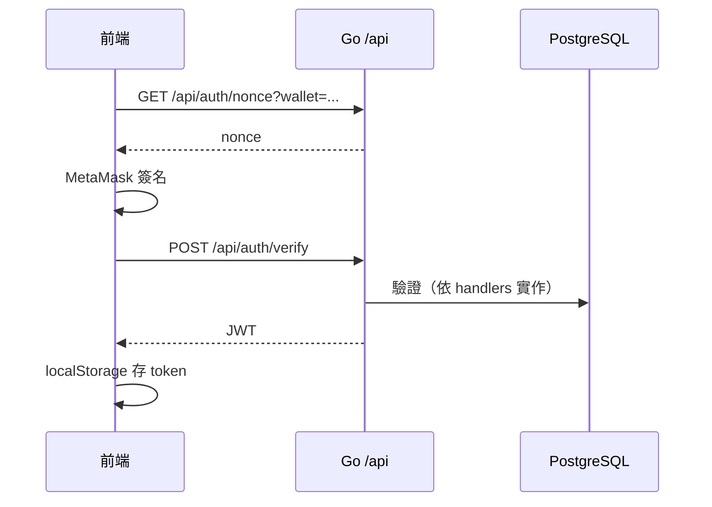
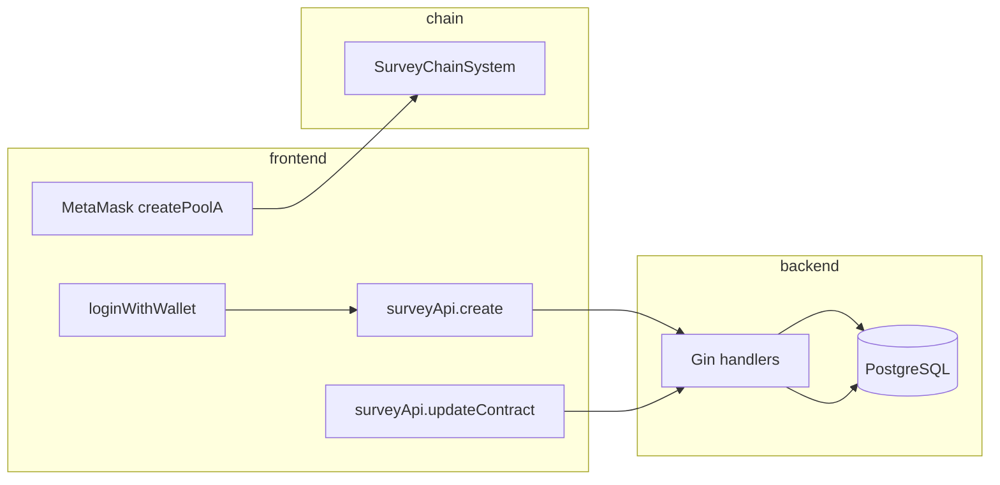

# SurveyChainPublic-Team6 — 專案架構說明

本文件彙整倉庫的**檔案架構**、**各目錄職責**，以及**資料流（前端 → 後端 → 合約）**。

---

## 1. 專案總覽

本專案為問卷／鏈上問卷（SurveyChain）相關系統，主要分為三塊：

| 區塊 | 技術 | 角色 |
|------|------|------|
| **backend** | Go（Gin） | HTTP API、JWT 認證、PostgreSQL（GORM） |
| **frontend** | React + Vite + TypeScript | 問卷 UI、錢包（MetaMask）、呼叫後端與鏈上交易 |
| **contract** | Solidity | `SurveyChainSystem`：獎池、參與、Chainlink VRF 抽獎等 |

---

## 2. 檔案架構（目錄樹）

已排除 `.git` 與 `node_modules`（依賴體積大，非業務原始碼）。

```
SurveyChainPublic-Team6/
├── .gitignore
├── README.md
├── docs/
│   └── PROJECT_ARCHITECTURE.md    # 本文件
├── backend/
│   ├── main.go
│   ├── go.mod, go.sum
│   ├── .env.example, .gitignore, README.md
│   ├── db/
│   │   └── db.go
│   ├── handlers/
│   │   ├── answer.go
│   │   ├── auth.go
│   │   ├── participant.go
│   │   └── survey.go
│   ├── middleware/
│   │   └── auth.go
│   ├── models/
│   │   └── models.go
│   └── routes/
│       └── routes.go
├── contract/
│   ├── README.md
│   └── contracts/
│       └── contracts/
│           └── SurveyChainSystem.sol
└── frontend/
    ├── README.md
    ├── SurveyChain Structure.md
    ├── todo.md
    └── client/
        ├── index.html
        ├── package.json, package-lock.json
        ├── tsconfig.json, vite.config.ts
        ├── public/
        ├── dist/                    # 建置產物
        └── src/
            ├── main.tsx, App.tsx
            ├── index.css, const.ts, vite-env.d.ts
            ├── _core/hooks/useAuth.ts
            ├── pages/
            │   ├── Home.tsx
            │   ├── SurveyList.tsx
            │   ├── SurveyDetail.tsx
            │   ├── CreateSurvey.tsx
            │   ├── NotFound.tsx
            │   └── ComponentShowcase.tsx
            ├── components/
            │   ├── Navbar.tsx, SurveyCard.tsx
            │   ├── DashboardLayout.tsx, DashboardLayoutSkeleton.tsx
            │   ├── ErrorBoundary.tsx
            │   └── ui/                # 共用 UI 元件
            ├── contexts/
            │   ├── ThemeContext.tsx
            │   └── WalletContext.tsx
            ├── hooks/
            ├── lib/
            │   ├── api.ts
            │   ├── contractABI.ts
            │   ├── network.ts
            │   ├── utils.ts
            │   └── web3Auth.ts
            └── shared/
                └── const.ts
```

---

## 3. 各目錄職責

### 3.1 `frontend/client`

| 區域 | 職責 |
|------|------|
| `src/pages/` | 主要畫面與流程：首頁、問卷列表、建立、詳情、404 等 |
| `src/lib/api.ts` | REST 客戶端：`/api/auth/*`、`/api/surveys/*`；JWT 存於 `localStorage` |
| `src/lib/network.ts` | Sepolia 常數、`VITE_CONTRACT_ADDRESS`、金額與 Etherscan 連結 |
| `src/lib/web3Auth.ts` | 錢包簽名登入（搭配 `authApi`） |
| `src/contexts/WalletContext.tsx` | MetaMask 連線、切換 Sepolia |
| `src/components/` | 版面、問卷卡片、錯誤邊界；`ui/` 為共用元件庫 |
| `vite.config.ts` | 開發時將 `/api` **proxy** 至 `http://127.0.0.1:8080` |

### 3.2 `backend`

| 區域 | 職責 |
|------|------|
| `main.go` | 載入環境變數、CORS、`/health`、掛載 `/api`、監聽 `:8080` |
| `routes/routes.go` | 註冊 `/api/*` 與是否需 JWT |
| `handlers/` | `auth`、`survey`、`participant`、`answer` 等 HTTP 處理 |
| `middleware/auth.go` | 保護需登入的 API |
| `models/` | GORM 模型：問卷、題目、選項、參與者、作答、公布正解 |
| `db/db.go` | PostgreSQL 連線與 `AutoMigrate` |

後端**不**代使用者簽署鏈上交易；負責業務資料、權限，以及與鏈上對齊的欄位（合約地址、Pool ID、交易雜湊等）。

### 3.3 `contract`

| 區域 | 職責 |
|------|------|
| `SurveyChainSystem.sol` | **Pool A**：建池、`voteA`、`drawA`（Chainlink VRF）；**Pool B**：競猜、`betB`、`resolveAndDrawB` 等；領獎與事件 |

---

## 4. 資料流概觀

系統有**兩條並行管線**，再以資料庫欄位對齊：

1. **HTTP**：瀏覽器 →（開發環境經 Vite proxy）→ **Go API** → **PostgreSQL**。
2. **鏈上**：瀏覽器 **MetaMask** → **Sepolia** → **`SurveyChainSystem`**。

合約不會直接呼叫後端；鏈上交易由前端發起後，再由前端在適當時機呼叫 API，將 `contractAddress`、`contractPoolId`、`poolType`、各種 `transactionHash` 等寫回資料庫。

---

## 5. 典型流程（序列／流程圖）

### 5.1 登入（後端 + 錢包簽名）



### 5.2 建立問卷（後端優先，可選鏈上 Pool A）

流程與 `CreateSurvey.tsx` 一致：先取得 JWT → `POST /api/surveys`；若設定 `VITE_CONTRACT_ADDRESS` 且有獎金，再以 MetaMask 呼叫 `createPoolA`，解析事件後 `PATCH /api/surveys/:id/contract`。



### 5.3 瀏覽與填答

- **列表／詳情**：`GET /api/surveys`、`GET /api/surveys/:id`（公開）。
- **是否已參與**：`GET /api/surveys/:id/check-participation?wallet=...`。
- **提交答案**：需 JWT → `POST /api/surveys/:id/participate`。

若有鏈上參與費等，`SurveyDetail` 會透過 `eth_sendTransaction` 對合約送交易，並將相關雜湊等透過 API 一併回寫後端。

### 5.4 公布正解與抽獎

- **公布正解**：`POST /api/surveys/:id/answers`（JWT）。
- **可抽獎名單**：`GET /api/surveys/:id/qualified`。
- **鏈上抽獎**：前端呼叫合約（如 `drawA`）；完成後 `POST /api/surveys/:id/draw` 同步後端。

---

## 6. 三者對齊方式（對照表）

| 概念 | 主要存放位置 | 用途 |
|------|----------------|------|
| 問卷標題、題目、選項、截止、狀態 | PostgreSQL | UI 與業務邏輯 |
| API 權限 | JWT（前端）+ 後端驗證 | 保護建立／更新／參與等 API |
| 獎池、參與、VRF 抽獎、領獎 | 智能合約 | 資產與鏈上隨機性 |
| `contractAddress`、`contractPoolId`、`poolType`、`*Hash` | DB 欄位 | 問卷與鏈上 Pool／交易對應 |

---

## 7. 後端 API 路由一覽（`/api`）

註冊於 `backend/routes/routes.go`：

| 方法 | 路徑 | 認證 |
|------|------|------|
| GET | `/api/auth/nonce` | 否 |
| POST | `/api/auth/verify` | 否 |
| GET | `/api/surveys` | 否 |
| GET | `/api/surveys/:id` | 否 |
| GET | `/api/surveys/:id/participants` | 否 |
| GET | `/api/surveys/:id/check-participation` | 否 |
| GET | `/api/surveys/:id/qualified` | 否 |
| POST | `/api/surveys` | 是（JWT） |
| PATCH | `/api/surveys/:id/status` | 是 |
| PATCH | `/api/surveys/:id/contract` | 是 |
| POST | `/api/surveys/:id/draw` | 是 |
| POST | `/api/surveys/:id/participate` | 是 |
| POST | `/api/surveys/:id/answers` | 是 |

---

## 8. 其他說明

- **`frontend/client/node_modules`**：npm 依賴，不需手動瀏覽。
- **`frontend/client/dist/`**：前端建置輸出；開發以 `src/` 為主。
- **合約路徑**：`contract/contracts/contracts/` 為雙層 `contracts` 目錄，與既有專案結構一致。

---

*文件產生自專案原始碼掃描；若程式變更，請同步更新本文件。*
